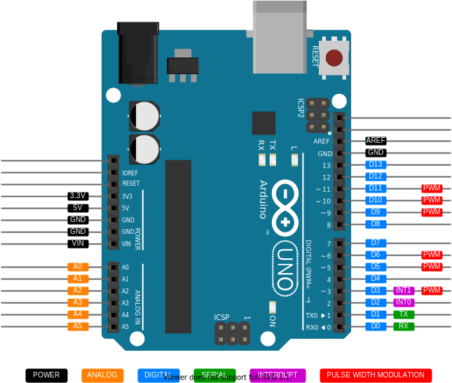

# (PART\*) Part I - Basics 👨‍🏫 {-} 

# What is Arduino

Arduino is an open-source electronics platform based on easy-to-use hardware and software. Arduino boards can read inputs like light falling on a sensor, a finger pushing on a button, or even a Twitter message - and turn it into an output like activating a motor, turning on/off an LED, publishing something online.

In simple terms, Arduino acts as the brain in an electronic project. It handles all the information, decides the actions based on the information received, and created the required output. 


## Arduino board

Find more about the Arduino Uno board on their [official website](https://store.arduino.cc/usa/arduino-uno-rev3). 

```{r fig.cap= '(Top row: left to right) Unboxing the Arduino, front side; (Bottom row: left to right) isometric view, back side', fig.align='center', fig.show='hold', echo=FALSE, out.width = '50%'}
knitr::include_graphics(c('assets/images/arduino-uno-unbox.jpg', 'assets/images/arduino-uno-front.jpg', 'assets/images/arduino-uno-iso.jpg', 'assets/images/arduino-uno-back.jpg'))
```


## Arduino pinout

The name of the most used available pin on the Arduino board is shown below. You will find yourself keep coming back to this figure, so it's useful to print out this image or draw a rough sketch for a ready reference.

```{r fig.cap= 'Arduino pinout', fig.align='center', echo=FALSE, out.width = '100%'}

```

