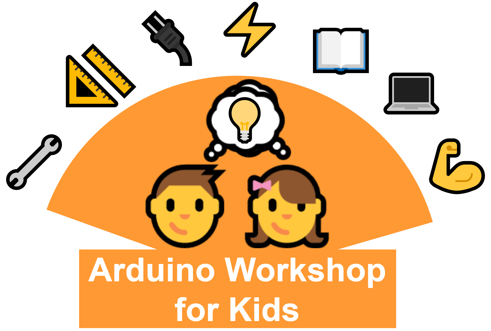

 <!-- PROJECT LOGO -->
 

  
  <h2 align="center">Arduino Workshop For kids</h2>
  

    Fun experiments with arduino for kids   
   
    <a href="https://kulbhushanchand.github.io/ArduinoWorkshopForKids/"><strong>Explore the book »</strong></a>
     
  

---
 

## Table of Contents

- [About the Project](#about-the-project)
- [Support the project](#support-the-project)

## About the project

This book lists 15 fun Arduino experiments for the kids. These experiments can best be part of an Arduino workshop for kids. It's not only for kids but anyone who has just started working with Arduino can use these projects as their journey towards learning. 

What this book is ✔️  

- for kids to kick start their journey in electronics
- a reference guide to conducting `Arduino workshop for kids`
- a fun reading about the simple Arduino projects

What this book is not ❌  

- meant to teach advanced electronic concepts
- meant to teach advanced programming concepts

## Support the project ❤️ 

This book along with source code is **freely available**. However, this is a **work in progress** and creating content and updating the book takes a lot of effort. If you like this book and want to support its development, consider supporting this project by following ways -

- **Sponsor** by donating something at [paypalme/KulbhushanChand](https://www.paypal.me/KulbhushanChand)
- **Share️** the project links: [Online book](https://kulbhushanchand.github.io/ArduinoWorkshopForKids) and [Source code repository](https://github.com/kulbhushanchand/ArduinoWorkshopForKids)
- **Star** the [GitHub repository](https://github.com/kulbhushanchand/ArduinoWorkshopForKids)

