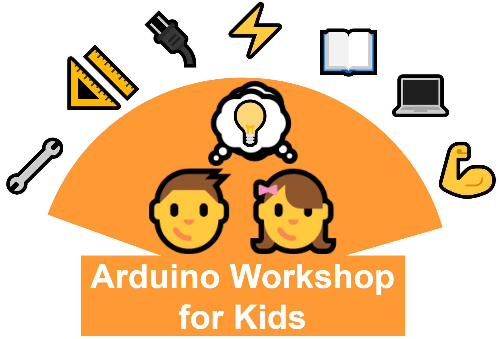

--- 
title: "Arduino Workshop For Kids"
author: "Kulbhushan Chand"
date: "`r Sys.Date()`"
site: bookdown::bookdown_site
documentclass: book
#bibliography: [ref.bib]
#biblio-style: apalike
#link-citations: yes
#github-repo: 
description: "This book lists 15 fun arduino-experiments for the kids. These experiments can best be the part of an arduino workshop for kids."
#cover-image: assets/images/book-cover.jpg
---


# Preface {#preface -}

```{r fig.align='center', echo=FALSE, out.width = '100%'}

```

This book lists 15 fun Arduino experiments for the kids. These experiments can best be part of an Arduino workshop for kids.

## Where did this book come from? {-}

In Nov 2017 I was part of two days `Arduino workshop for kids`. My work was to create the content and conduct (as a resource person) the workshop. There were 20 participants in the age group less than 19 years. Participants took part in 15 challenges (Arduino projects) which progressively increase in difficulty. It was an awesome experience seeing the young ones taking immense interest and standing up to the challenges. The workshop was covered by [local newspaper](https://www.tribuneindia.com/news/archive/jalandhar/young-minds-dwell-on-e-concepts-496919) and was thoroughly praised.

To better help the outreach of this workshop among the young kids, I created this book. It includes everything that was in the workshop. The goal is to help the curious young minds by giving them a head start in developing electronics projects. Therefore the workshop contents are made available in the form of a free and easy-to-access book. Also, in this way, I can contribute my part to the open-source community. 


## Who is this book for? {-}

This book is primarily written for young kids who have no experience with electronics projects. The structure of the book is kept simple and the writing is easy to follow. It's not only for kids but anyone who has just started working with Arduino can use these projects as their journey towards learning. 

What this book is ✔️  

- for kids to kick start their journey in electronics
- a reference guide to conducting `Arduino workshop for kids`
- a fun reading about the simple Arduino projects

What this book is not ❌  

- meant to teach advanced electronic concepts
- meant to teach advanced programming concepts


## Who am I? {-}

I am a PhD student at the [National Institute of Technology Jalandhar](https://www.nitj.ac.in/). I enjoy working on electronics hardware/software projects and learning new tools & technologies. When not working, I like running and cycling. You can find more about me at - https://kulbhushanchand.github.io/about/


## Support this work ❤️ {-} 

I support open-source hardware/software and open science. Therefore, this version of this book will always be freely available! However, creating content and updating the book takes a lot of effort. So, if you like this book and want to support its development, consider supporting this work in the following ways. It will help me a lot!

- **Sponsor** by donating something at [paypalme/KulbhushanChand](https://www.paypal.me/KulbhushanChand)
- **Share️** the project links: [Online book](https://kulbhushanchand.github.io/ArduinoWorkshopForKids) and [Source code repository](https://github.com/kulbhushanchand/ArduinoWorkshopForKids)
- **Star** the [GitHub repository](https://github.com/kulbhushanchand/ArduinoWorkshopForKids)


## Acknowledgements {-}

I would like to thank my PhD supervisor [Prof. Arun Khosla](https://www.nitj.ac.in/index.php/nitj_cinfo/Faculty/38) for his guidance and kind support. I also want to acknowledge the open-source tools used in some parts of this project.

- [Fritzing](https://fritzing.org/) is used to create the connection diagram.
- [drawio-desktop](https://github.com/jgraph/drawio-desktop) is used to create the logo and diagrams.


