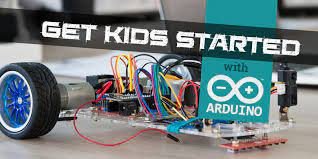

--- 
title: "Arduino Workshop For kids"
author: "Kulbhushan Chand"
date: "`r Sys.Date()`"
site: bookdown::bookdown_site
documentclass: book
bibliography: [book.bib]
biblio-style: apalike
link-citations: yes
#github-repo: 
description: "This book lists 15 fun arduino-experiments for the kids. These experiments can best be the part of an arduino workshop for kids."
#cover-image: assets/images/book-cover.jpg
---


# Preface {#preface -}

```{r fig.align='center', echo=FALSE, out.width = '75%'}
#
```

This book lists 15 fun arduino-experiments for the kids. These experiments can best be the part of an arduino workshop for kids.

## Where did this book come from? {-}

## Who is this book for? {-}

What this book is

What this book is not


## Why is arduino so great? {-}


## Who am I? {-}

### Please consider a donation!


### Acknowledgements


## Contributions and Acknowledgements {-}


